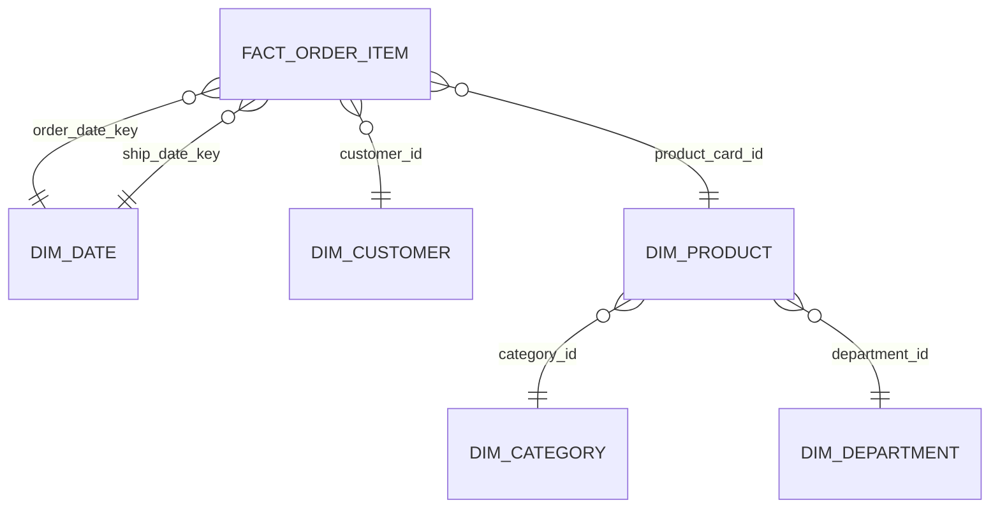

# Gold Star Schema



## Grain

`gold.fact_order_item` has **1 row per `order_item_id`** (order line).

## Tables

### Fact

- `gold.fact_order_item`

### Dimensions

- `gold.dim_date` (date_key)
- `gold.dim_customer` (customer_id)
- `gold.dim_product` (product_card_id)
- `gold.dim_category` (category_id)
- `gold.dim_department` (department_id)

## Dimension row counts

- dim_date: 1,133
- dim_customer: 20,652
- dim_product: 118
- dim_category: 51
- dim_department: 11

## Join keys

- fact_order_item.customer_id -> dim_customer.customer_id
- fact_order_item.product_card_id -> dim_product.product_card_id
- fact_order_item.order_date_key -> dim_date.date_key
- fact_order_item.ship_date_key -> dim_date.date_key
- dim_product.category_id -> dim_category.category_id
- dim_product.department_id -> dim_department.department_id

## KPI field mapping

- gross_sales = sales
- net_sales = order_item_total
- discount_amount = order_item_discount
- discount_rate = order_item_discount_rate
- profit = order_profit_per_order

## Gold validations

### Fact row count

- silver_rows: 180,519
- fact_rows: 180,519

### FK coverage (should be near 100%)

- missing_customer_dim: 0
- missing_product_dim: 0

### Date key coverage

- missing_order_date_key: 0

## Modeling Decisions & Architectural Notes

- **Star Schema Implementation**: Transformed the flat Silver dataset into a highly optimized Star Schema. By isolating 180,000+ transactions into specific dimensions (118 products, 51 categories), which significantly reduced storage redundancy and improved query performance for downstream BI tools.
- **PII Filtering & Data Governance**: Successfully implemented privacy-by-design at the Silver layer. All direct identifiers (Customer Names, Emails, Passwords) were excluded from the Gold layer, ensuring that the Fact and Dimension tables are compliant for business-wide reporting.
- **Time-Intelligence Foundation**: The `dim_date` table was programmatically generated to cover the full operational range (1,133 days). This enables seamless Year-over-Year (YoY) and Month-over-Month (MoM) growth metrics.
- **Integer Join Optimization**: Implemented `date_key` as an INT (YYYYMMDD), ensuring joins between the Fact table and the Calendar dimension are significantly faster than joining on raw Timestamp objects.

```

```
