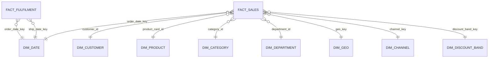

# Gold Data Quality Report

## Snapshot (Build Results)

## Star Schema (Gold)



### 1) Row Counts

| table_name             |   rows |
| ---------------------- | -----: |
| gold.dim_date          |   1133 |
| gold.dim_customer      |  20652 |
| gold.dim_product       |    118 |
| gold.dim_category      |     51 |
| gold.dim_department    |     11 |
| gold.dim_geo           |   3772 |
| gold.dim_channel       |     92 |
| gold.dim_discount_band |      6 |
| gold.fact_sales        | 180519 |
| gold.fact_fulfilment   | 180519 |

### 2) Dimension Key Uniqueness (rows must equal distinct keys)

All dimensions passed uniqueness checks:

- dim_date 1133/1133
- dim_customer 20652/20652
- dim_product 118/118
- dim_category 51/51
- dim_department 11/11
- dim_geo 3772/3772
- dim_channel 92/92
- dim_discount_band 6/6

### 3) Fact Grain Uniqueness (rows must equal distinct order_item_id)

- fact_sales: 180519 rows, 180519 distinct order_item_id
- fact_fulfilment: 180519 rows, 180519 distinct order_item_id

### 4) Null Checks (core keys)

fact_fulfilment null checks:

- order_item_id: 0
- order_id: 0
- customer_id: 0
- product_card_id: 0
- order_date_key: 0
- ship_date_key: 0

### 5) FK Coverage (Sales Fact)

All FK coverage checks returned 0 missing keys:

- order_date_dim, customer_dim, product_dim, geo_dim, channel_dim, discount_band_dim, category_dim, department_dim: **0**
- fact_rows: 180519

### 6) FK Coverage (Fulfilment Fact)

All FK coverage checks returned 0 missing keys:

- order_date_dim, ship_date_dim, customer_dim, product_dim, geo_dim, channel_dim, category_dim, department_dim: **0**
- fact_rows: 180519

## Sanity Checks

### Sales measures

- discount_rate range: 0 to 0.25
- min net_sales: 7.489999771
- min gross_sales: 9.989999771
- min profit: -4274.97998 (negative profit exists and is treated as a valid business scenario)

### Fulfilment measures

- shipping_days_variance range: -2 to 4
- late_lines: 103400 / 180519 (~57.3%)

## Conclusion

Gold schema is structurally valid:

- No row loss vs Silver
- Grain enforced
- Dimensions unique
- 100% FK coverage
  Gold is ready for export to Snowflake and modelling in Power BI.

```

```
