# Databricks Gold CSV → Snowflake Gold (UI Load)

## Objective

Load the Databricks **Gold** layer exports (CSV files stored locally) into **Snowflake** using the **Snowsight UI**, then validate the star schema using row-count and foreign-key (FK) coverage checks. This creates a Snowflake-ready Gold layer for Power BI modelling.

---

## Simple process (one line)

**Create compute → create namespace → create tables → UI upload CSV → validate row counts + FK joins → save proof pack.**

---

## Architecture snapshot

### Medallion to Snowflake mapping

- **Databricks Gold (Curated / Star Schema)**  
  ↓ exported as local CSVs
- **Snowflake Gold (Analytical layer / Star Schema)**  
  ↓ validated and ready for BI
- **Power BI (semantic model + DAX + visuals)**

---

## What was loaded

### Dimensions

- `DIM_DATE`
- `DIM_CATEGORY`
- `DIM_DEPARTMENT`
- `DIM_GEO`
- `DIM_DISCOUNT_BAND`
- `DIM_CHANNEL`
- `DIM_PRODUCT`
- `DIM_CUSTOMER`

### Facts

- `FACT_SALES`
- `FACT_FULFILMENT`
- `FACT_ORDER_ITEM` (wide convenience fact: combines sales + fulfilment attributes)

---

## Snowflake objects created

Snowflake needs 3 things for this workflow:

1. **Warehouse (Compute)**

   - A warehouse is the compute engine that runs queries and loads.
   - It auto-suspends when idle to save credits.

2. **Database + Schema**

   - Database = project container (e.g., `DATACO`)
   - Schema = logical grouping (e.g., `GOLD`)

3. **Tables + CSV File Format**
   - Tables define the final structure.
   - A CSV file format defines how Snowflake reads CSVs (delimiter, header row, quote rules).

---

## Loading method used

For loading data, **Snowsight UI (Load Data)** was used instead of SnowSQL.

Why UI load:

- Fast to execute for first-time Snowflake usage
- No local client installation required
- Easy to capture proof screenshots for portfolio evidence

---

## Step-by-step run procedure (UI)

### Step 1 — Set session context

In Snowsight:

- Confirm you are using the correct **Role** (admin role for object creation)
- Confirm you have a working **Warehouse** selected (compute)

### Step 2 — Create the namespace

- Create project database and schema (Gold layer namespace)
- Switch the worksheet context into that schema

### Step 3 — Create tables

- Create all **dimension tables first**
- Create **fact tables second**
- Reason: facts depend on dimensions (FK joins for QA)

### Step 4 — Load each CSV into its table (UI)

For each table:

1. Navigate to: **Databases → DATACO → GOLD → Tables → <TABLE_NAME>**
2. Click: **Load Data**
3. Upload the corresponding CSV
4. Use the standard CSV settings (header row present, comma delimiter, quotes supported)
5. Review column mapping (ensure columns align by name)
6. Load and confirm “Successfully Loaded Data”

Notes:

- UI may show “data type mismatch” warnings (common for FLOAT columns).  
  If preview values are clean numeric values, proceed. Validation is confirmed after load.

### Step 5 — Validate the load (QA)

For each major milestone:

- Confirm row counts for each table
- Confirm fact table grain (fact rows and distinct `ORDER_ITEM_ID`)
- Confirm FK coverage (no orphan keys between facts and dimensions)

Outcome for this run:

- All three fact tables loaded with consistent grain (`ORDER_ITEM_ID` distinctness).
- FK coverage checks returned **0 missing keys** across all joins.

---

## Validation results summary (recorded)

Row counts after load:

| Table             |    Rows |
| ----------------- | ------: |
| DIM_DATE          |   1,133 |
| DIM_CATEGORY      |      51 |
| DIM_DEPARTMENT    |      11 |
| DIM_GEO           |   3,772 |
| DIM_DISCOUNT_BAND |       6 |
| DIM_CHANNEL       |      92 |
| DIM_PRODUCT       |     118 |
| DIM_CUSTOMER      |  20,652 |
| FACT_SALES        | 180,519 |
| FACT_FULFILMENT   | 180,519 |
| FACT_ORDER_ITEM   | 180,519 |

Integrity checks:

- `FACT_SALES` → all dimension joins present (0 missing)
- `FACT_FULFILMENT` → all dimension joins present (0 missing), including both date keys
- Grain checks: `COUNT(*) == COUNT(DISTINCT ORDER_ITEM_ID)` for each fact table

---

## Diagram — Snowflake star schema (conceptual)

```mermaid
erDiagram
DIM_DATE ||--o{ FACT_SALES : "ORDER_DATE_KEY"
DIM_DATE ||--o{ FACT_FULFILMENT : "ORDER_DATE_KEY"
DIM_DATE ||--o{ FACT_FULFILMENT : "SHIP_DATE_KEY"
DIM_DATE ||--o{ FACT_ORDER_ITEM : "ORDER_DATE_KEY"
DIM_DATE ||--o{ FACT_ORDER_ITEM : "SHIP_DATE_KEY"

DIM_CUSTOMER ||--o{ FACT_SALES : "CUSTOMER_ID"
DIM_CUSTOMER ||--o{ FACT_FULFILMENT : "CUSTOMER_ID"
DIM_CUSTOMER ||--o{ FACT_ORDER_ITEM : "CUSTOMER_ID"

DIM_PRODUCT ||--o{ FACT_SALES : "PRODUCT_CARD_ID"
DIM_PRODUCT ||--o{ FACT_FULFILMENT : "PRODUCT_CARD_ID"
DIM_PRODUCT ||--o{ FACT_ORDER_ITEM : "PRODUCT_CARD_ID"

DIM_CATEGORY ||--o{ FACT_SALES : "CATEGORY_ID"
DIM_CATEGORY ||--o{ FACT_FULFILMENT : "CATEGORY_ID"
DIM_CATEGORY ||--o{ FACT_ORDER_ITEM : "CATEGORY_ID"

DIM_DEPARTMENT ||--o{ FACT_SALES : "DEPARTMENT_ID"
DIM_DEPARTMENT ||--o{ FACT_FULFILMENT : "DEPARTMENT_ID"
DIM_DEPARTMENT ||--o{ FACT_ORDER_ITEM : "DEPARTMENT_ID"

DIM_GEO ||--o{ FACT_SALES : "GEO_KEY"
DIM_GEO ||--o{ FACT_FULFILMENT : "GEO_KEY"
DIM_GEO ||--o{ FACT_ORDER_ITEM : "GEO_KEY"

DIM_CHANNEL ||--o{ FACT_SALES : "CHANNEL_KEY"
DIM_CHANNEL ||--o{ FACT_FULFILMENT : "CHANNEL_KEY"
DIM_CHANNEL ||--o{ FACT_ORDER_ITEM : "CHANNEL_KEY"

DIM_DISCOUNT_BAND ||--o{ FACT_SALES : "DISCOUNT_BAND_KEY"
DIM_DISCOUNT_BAND ||--o{ FACT_ORDER_ITEM : "DISCOUNT_BAND_KEY"

DIM_CATEGORY ||--o{ DIM_PRODUCT : "CATEGORY_ID"
DIM_DEPARTMENT ||--o{ DIM_PRODUCT : "DEPARTMENT_ID"

DIM_DATE {
  NUMBER DATE_KEY PK
}

DIM_CUSTOMER {
  NUMBER CUSTOMER_ID PK
}

DIM_PRODUCT {
  NUMBER PRODUCT_CARD_ID PK
  NUMBER CATEGORY_ID FK
  NUMBER DEPARTMENT_ID FK
}

DIM_CATEGORY {
  NUMBER CATEGORY_ID PK
}

DIM_DEPARTMENT {
  NUMBER DEPARTMENT_ID PK
}

DIM_GEO {
  STRING GEO_KEY PK
}

DIM_CHANNEL {
  STRING CHANNEL_KEY PK
}

DIM_DISCOUNT_BAND {
  NUMBER DISCOUNT_BAND_KEY PK
}

FACT_SALES {
  NUMBER ORDER_ITEM_ID PK
  NUMBER CUSTOMER_ID FK
  NUMBER PRODUCT_CARD_ID FK
  NUMBER CATEGORY_ID FK
  NUMBER DEPARTMENT_ID FK
  NUMBER ORDER_DATE_KEY FK
  STRING GEO_KEY FK
  STRING CHANNEL_KEY FK
  NUMBER DISCOUNT_BAND_KEY FK
}

FACT_FULFILMENT {
  NUMBER ORDER_ITEM_ID PK
  NUMBER CUSTOMER_ID FK
  NUMBER PRODUCT_CARD_ID FK
  NUMBER CATEGORY_ID FK
  NUMBER DEPARTMENT_ID FK
  NUMBER ORDER_DATE_KEY FK
  NUMBER SHIP_DATE_KEY FK
  STRING GEO_KEY FK
  STRING CHANNEL_KEY FK
}

FACT_ORDER_ITEM {
  NUMBER ORDER_ITEM_ID PK
  NUMBER CUSTOMER_ID FK
  NUMBER PRODUCT_CARD_ID FK
  NUMBER CATEGORY_ID FK
  NUMBER DEPARTMENT_ID FK
  NUMBER ORDER_DATE_KEY FK
  NUMBER SHIP_DATE_KEY FK
  STRING GEO_KEY FK
  STRING CHANNEL_KEY FK
  NUMBER DISCOUNT_BAND_KEY FK
}
```

---

## Evidence preservation (trial account ready)

Because this was executed on a time-limited trial, a proof pack was saved locally and committed to GitHub.

### Saved artefacts

- Screenshots of:
  - Successful loads (facts + key dimensions)
  - Row counts output
  - FK coverage output
  - Query History
- Downloaded CSV results:
  - FK coverage outputs

Recommended folder:

- `proof/snowflake/`

---

## Common issues and how they were handled

### 1) “Data type mismatch” warnings (FLOAT columns)

- These warnings are typical when the loader infers strings but the table expects numeric.
- Proceed if preview values are numeric.
- Post-load validation confirms numeric min/max values exist.

### 2) ZIP codes showing numeric warnings

- ZIP/postal codes should remain text (VARCHAR), even if they look numeric, because leading zeros and non-numeric postal formats exist.

### 3) Timestamp strings with timezone suffix (e.g., `...Z`)

- Loaded into Snowflake timestamp fields successfully.
- Verified by non-null counts after load.

---

## Handover

Snowflake Gold is now ready for Power BI:

- Connect Power BI to Snowflake
- Build the semantic model (relationships, measures)
- Handle presentation formatting (e.g., money rounding) in the BI layer
- Build report pages, KPIs, and filters

---

## Completion criteria (met)

- All target tables created and loaded successfully
- Row counts recorded for all tables
- Fact grain checks passed
- FK coverage checks passed (0 missing keys)
- Proof pack saved for trial expiry risk management
